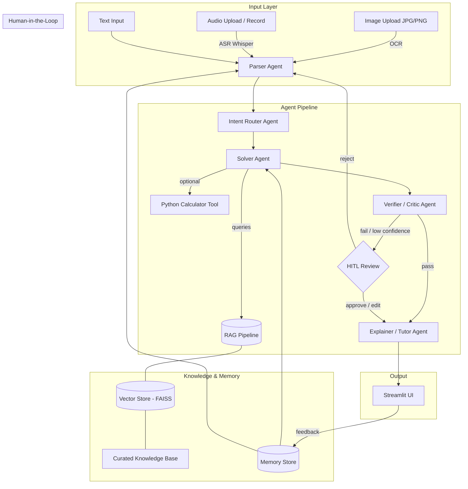

# Math Mentor — Content & Implementation Plan

## Project Overview

**Math Mentor** is a multimodal AI application that solves JEE-style math problems with step-by-step explanations. It accepts image, audio, and text inputs, uses a RAG pipeline backed by a curated math knowledge base, orchestrates work through a multi-agent system, incorporates human-in-the-loop (HITL) review, and learns from past interactions via a memory layer.

---

## Architecture Diagram



---

## Technology Stack

| Layer | Technology |
|---|---|
| Language | Python 3.11+ |
| LLM | OpenAI GPT-4o / Claude via API |
| OCR | Tesseract (pytesseract) + fallback EasyOCR |
| ASR | OpenAI Whisper (whisper or openai API) |
| Embeddings | OpenAI text-embedding-3-small |
| Vector Store | FAISS (faiss-cpu) |
| Agent Framework | LangChain / LangGraph |
| UI | Streamlit |
| Memory | SQLite + JSON files |
| Deployment | Streamlit Cloud / HuggingFace Spaces |
| Calculator | Python `sympy` + `math` |

---

## Content Plan — Module Breakdown

### Module 1: Multimodal Input & Parsing

#### 1A. Image Input (`input/image_handler.py`)
- Accept JPG/PNG uploads via Streamlit `file_uploader`
- Run OCR using pytesseract (primary) with EasyOCR fallback
- Compute OCR confidence score (character-level from Tesseract data)
- Display extracted text in an editable text area
- If confidence < threshold (e.g. 70%) → flag for HITL review
- Store original image path + extracted text in memory

#### 1B. Audio Input (`input/audio_handler.py`)
- Accept uploaded audio files (WAV/MP3/M4A) or record via `st_audiorec`
- Transcribe using Whisper (local small model or OpenAI Whisper API)
- Post-process transcript: normalize math phrases
  - "square root of x" → "√x"
  - "x raised to the power 3" → "x^3"
  - "integral of" → "∫"
  - "dy by dx" → "dy/dx"
- Display transcript for user confirmation / editing
- If Whisper returns low confidence or short/garbled text → ask for confirmation

#### 1C. Text Input (`input/text_handler.py`)
- Simple text area in Streamlit
- Pass directly to Parser Agent

### Module 2: Parser Agent (`agents/parser_agent.py`)

**Responsibilities:**
- Clean OCR/ASR artifacts (extra whitespace, broken symbols)
- Use LLM to identify the mathematical question
- Extract structured output:

```json
{
  "problem_text": "Find the derivative of f(x) = x^3 + 2x^2 - 5x + 1",
  "topic": "calculus",
  "subtopic": "derivatives",
  "variables": ["x"],
  "constraints": [],
  "needs_clarification": false,
  "clarification_reason": null
}
```

- If `needs_clarification = true` → trigger HITL with reason
- Apply memory-based correction rules (e.g. known OCR misreads)

### Module 3: RAG Pipeline (`rag/`)

#### 3A. Knowledge Base (`rag/knowledge_base/`)
Curate 20–30 markdown documents organized by topic:

| # | Document | Topic |
|---|---|---|
| 1 | `algebra_identities.md` | Algebra — identities and expansions |
| 2 | `algebra_equations.md` | Algebra — solving equations (quadratic, cubic) |
| 3 | `algebra_inequalities.md` | Algebra — inequalities and ranges |
| 4 | `algebra_sequences.md` | Algebra — AP, GP, HP formulas |
| 5 | `algebra_logarithms.md` | Algebra — log properties and equations |
| 6 | `algebra_complex_numbers.md` | Algebra — complex number operations |
| 7 | `prob_basics.md` | Probability — definitions, axioms, basic rules |
| 8 | `prob_conditional.md` | Probability — conditional, Bayes theorem |
| 9 | `prob_distributions.md` | Probability — binomial, Poisson basics |
| 10 | `prob_permutations.md` | Probability — permutations and combinations |
| 11 | `calc_limits.md` | Calculus — limits, L'Hopital's rule |
| 12 | `calc_derivatives.md` | Calculus — differentiation rules and formulas |
| 13 | `calc_applications.md` | Calculus — maxima, minima, rate of change |
| 14 | `calc_integration_basics.md` | Calculus — basic integration |
| 15 | `linalg_matrices.md` | Linear Algebra — matrix operations |
| 16 | `linalg_determinants.md` | Linear Algebra — determinants and properties |
| 17 | `linalg_vectors.md` | Linear Algebra — vectors, dot/cross product |
| 18 | `linalg_systems.md` | Linear Algebra — solving systems of equations |
| 19 | `common_mistakes.md` | Cross-topic — frequent student errors |
| 20 | `solution_templates.md` | Cross-topic — step-by-step solution templates |
| 21 | `domain_constraints.md` | Cross-topic — domain, range, unit checks |
| 22 | `trig_identities.md` | Trigonometry basics (supporting topic) |
| 23 | `jee_tips.md` | JEE-specific tips, shortcuts, common traps |

#### 3B. Chunking & Embedding (`rag/indexer.py`)
- Load all markdown docs
- Chunk with `RecursiveCharacterTextSplitter` (chunk_size=500, overlap=50)
- Embed each chunk with OpenAI `text-embedding-3-small`
- Store in FAISS index (persisted to disk)
- Metadata per chunk: `{source_file, topic, chunk_index}`

#### 3C. Retriever (`rag/retriever.py`)
- Accept query string (the parsed problem text)
- Retrieve top-k (k=5) chunks by cosine similarity
- Return chunks with source metadata
- If no chunk exceeds similarity threshold → flag "no relevant context found" (prevents hallucinated citations)

### Module 4: Multi-Agent System (`agents/`)

#### Agent 1: Parser Agent (`agents/parser_agent.py`)
- Described in Module 2 above

#### Agent 2: Intent Router Agent (`agents/router_agent.py`)
- Input: structured problem from Parser
- Classify into: `algebra | probability | calculus | linear_algebra`
- Determine sub-strategy:
  - Direct formula application
  - Step-by-step derivation
  - Numerical computation
  - Proof-based
- Route to Solver with strategy hint
- Output routing decision to agent trace

#### Agent 3: Solver Agent (`agents/solver_agent.py`)
- Input: structured problem + routing strategy + RAG context
- Query RAG pipeline for relevant formulas / templates
- Query memory for similar past problems
- Solve using LLM with:
  - Retrieved context injected into prompt
  - Optional tool calls to Python calculator (sympy) for computation
- Output: detailed solution with intermediate steps
- Cite which RAG sources were used

#### Agent 4: Verifier / Critic Agent (`agents/verifier_agent.py`)
- Input: problem + proposed solution
- Checks:
  - **Correctness**: re-derive or substitute values to verify answer
  - **Domain/units**: check variable domains, sign constraints
  - **Edge cases**: division by zero, undefined expressions
  - **Consistency**: does answer match problem constraints?
- Output confidence score (0–1)
- If confidence < 0.7 → trigger HITL
- If verification fails → send back to Solver with feedback

#### Agent 5: Explainer / Tutor Agent (`agents/explainer_agent.py`)
- Input: verified solution
- Rewrite solution in student-friendly language
- Format as numbered steps
- Highlight key formulas used (with RAG source references)
- Add "Common Mistake" callout if relevant
- Add "JEE Tip" if applicable
- Output: final explanation (markdown formatted)

#### Agent Orchestrator (`agents/orchestrator.py`)
- Manages the pipeline: Parser → Router → Solver → Verifier → Explainer
- Handles retries (Verifier → Solver loop, max 2 retries)
- Collects agent trace log for UI display
- Handles HITL interrupts

### Module 5: Streamlit UI (`app.py`)

#### Layout

```
┌─────────────────────────────────────────────────┐
│  Math Mentor                          [Settings] │
├────────────┬────────────────────────────────────┤
│            │                                     │
│  Input     │   Main Panel                        │
│  Panel     │                                     │
│            │   ┌─────────────────────────────┐   │
│  [Text]    │   │ Extracted / Parsed Input     │   │
│  [Image]   │   │ (editable)                   │   │
│  [Audio]   │   └─────────────────────────────┘   │
│            │                                     │
│  ───────── │   ┌─────────────────────────────┐   │
│            │   │ Solution + Explanation       │   │
│  Agent     │   │ (step-by-step)               │   │
│  Trace     │   │                               │   │
│  Panel     │   │ Confidence: ██████░░ 85%     │   │
│            │   └─────────────────────────────┘   │
│  1. Parser │                                     │
│  2. Router │   ┌─────────────────────────────┐   │
│  3. Solver │   │ Retrieved Context (sources)  │   │
│  4. Verify │   └─────────────────────────────┘   │
│  5. Explain│                                     │
│            │   [✅ Correct] [❌ Wrong] [💬 Comment]│
│            │                                     │
└────────────┴────────────────────────────────────┘
```

#### UI Components
- **Input mode selector**: radio buttons (Text / Image / Audio)
- **Extraction preview**: editable text area showing OCR/ASR output
- **Agent trace**: expandable sidebar showing each agent's input/output/timing
- **Retrieved context panel**: collapsible section listing RAG chunks + sources
- **Solution display**: markdown-rendered step-by-step explanation
- **Confidence indicator**: progress bar with numeric percentage
- **Feedback buttons**: Correct / Incorrect + optional comment text input
- **Memory panel**: show if similar past problems were found and reused

### Module 6: Deployment

#### Option A: Streamlit Cloud (Primary)
- `requirements.txt` with pinned versions
- `secrets.toml` for API keys (via Streamlit Cloud secrets)
- `.streamlit/config.toml` for theme/settings
- Free tier supports the app

#### Option B: HuggingFace Spaces (Fallback)
- Dockerfile or `app.py` entry point
- Environment variables for API keys

#### Deployment Checklist
- [ ] App runs locally with `streamlit run app.py`
- [ ] All API keys externalized to environment variables
- [ ] `.env.example` provided
- [ ] `requirements.txt` complete and tested
- [ ] Deployed URL accessible and functional

### Module 7: Human-in-the-Loop (`hitl/`)

#### HITL Trigger Points
| Trigger | Source | Action |
|---|---|---|
| Low OCR confidence (<70%) | Image Handler | Show extracted text, ask user to confirm/edit |
| Low ASR confidence | Audio Handler | Show transcript, ask user to confirm/edit |
| Parser ambiguity | Parser Agent | Show parsed structure, ask user to clarify |
| Verifier low confidence (<70%) | Verifier Agent | Show solution, ask user to approve/edit/reject |
| User-initiated | UI Button | Re-trigger verification pipeline |

#### HITL Flow (`hitl/review.py`)
1. Pipeline pauses at trigger point
2. UI displays current state + reason for review
3. User options: **Approve** / **Edit** / **Reject**
4. If Approved → continue pipeline, store as positive signal
5. If Edited → use edited version, store correction in memory
6. If Rejected → re-run from appropriate agent with feedback

### Module 8: Memory & Self-Learning (`memory/`)

#### Memory Store Schema (`memory/store.py`)

```json
{
  "id": "uuid",
  "timestamp": "2026-02-28T10:00:00Z",
  "input_type": "image|audio|text",
  "original_input_ref": "path or text",
  "ocr_asr_output": "raw extracted text",
  "parsed_problem": { "structured format from parser" },
  "topic": "calculus",
  "retrieved_context": ["chunk_ids"],
  "solution": "final solution text",
  "steps": ["step1", "step2"],
  "verifier_confidence": 0.92,
  "verifier_outcome": "pass|fail",
  "user_feedback": "correct|incorrect",
  "user_comment": "optional correction note",
  "correction_applied": "edited text if any",
  "embedding": [0.1, 0.2, ...]
}
```

#### Memory Usage at Runtime
1. **Similar Problem Retrieval**: embed parsed problem → search memory store → if similar problem found with positive feedback → reuse solution pattern
2. **OCR/ASR Correction Rules**: if a correction was applied to OCR/ASR output, store the mapping (e.g. "∑" misread as "E") and apply it to future inputs
3. **Solution Pattern Reuse**: if a similar problem was solved before, prime the Solver Agent with the previous approach
4. **Confidence Calibration**: track verifier accuracy vs. user feedback to adjust confidence thresholds

#### Storage Backend
- SQLite database for structured records
- FAISS index for memory embeddings (separate from RAG index)
- JSON files for correction rules

---

## File Structure

```
math-mentor/
├── app.py                          # Streamlit entry point
├── requirements.txt
├── .env.example
├── .streamlit/
│   └── config.toml
├── CLAUDE.md                       # This file
├── README.md
│
├── input/
│   ├── __init__.py
│   ├── image_handler.py            # OCR pipeline
│   ├── audio_handler.py            # ASR pipeline
│   └── text_handler.py             # Text preprocessing
│
├── agents/
│   ├── __init__.py
│   ├── orchestrator.py             # Agent pipeline coordinator
│   ├── parser_agent.py             # Raw input → structured problem
│   ├── router_agent.py             # Intent classification + routing
│   ├── solver_agent.py             # RAG-augmented problem solving
│   ├── verifier_agent.py           # Solution verification
│   └── explainer_agent.py          # Student-friendly explanation
│
├── rag/
│   ├── __init__.py
│   ├── indexer.py                  # Chunk, embed, build FAISS index
│   ├── retriever.py                # Query FAISS, return top-k chunks
│   └── knowledge_base/
│       ├── algebra_identities.md
│       ├── algebra_equations.md
│       ├── algebra_inequalities.md
│       ├── algebra_sequences.md
│       ├── algebra_logarithms.md
│       ├── algebra_complex_numbers.md
│       ├── prob_basics.md
│       ├── prob_conditional.md
│       ├── prob_distributions.md
│       ├── prob_permutations.md
│       ├── calc_limits.md
│       ├── calc_derivatives.md
│       ├── calc_applications.md
│       ├── calc_integration_basics.md
│       ├── linalg_matrices.md
│       ├── linalg_determinants.md
│       ├── linalg_vectors.md
│       ├── linalg_systems.md
│       ├── common_mistakes.md
│       ├── solution_templates.md
│       ├── domain_constraints.md
│       ├── trig_identities.md
│       └── jee_tips.md
│
├── hitl/
│   ├── __init__.py
│   └── review.py                   # HITL trigger logic + UI hooks
│
├── memory/
│   ├── __init__.py
│   ├── store.py                    # SQLite + FAISS memory backend
│   └── correction_rules.json       # Learned OCR/ASR corrections
│
├── tools/
│   ├── __init__.py
│   └── calculator.py               # Sympy-based math calculator
│
├── tests/
│   ├── test_parser.py
│   ├── test_rag.py
│   ├── test_solver.py
│   └── test_memory.py
│
└── assets/
    └── architecture.png            # Exported architecture diagram
```

---

## Implementation Order

| Phase | Tasks | Priority |
|---|---|---|
| **Phase 1** | Project setup, env config, file structure, knowledge base docs | P0 |
| **Phase 2** | RAG pipeline (indexer + retriever + FAISS) | P0 |
| **Phase 3** | Parser Agent + Text input handler | P0 |
| **Phase 4** | Router Agent + Solver Agent (with RAG integration) | P0 |
| **Phase 5** | Verifier Agent + Explainer Agent + Orchestrator | P0 |
| **Phase 6** | Streamlit UI (basic layout, text input flow) | P0 |
| **Phase 7** | Image input (OCR) + Audio input (ASR) | P0 |
| **Phase 8** | HITL triggers + review flow in UI | P0 |
| **Phase 9** | Memory store + similar problem retrieval | P0 |
| **Phase 10** | End-to-end testing + polish | P0 |
| **Phase 11** | Deployment (Streamlit Cloud) | P0 |
| **Phase 12** | Demo video recording | P0 |

---

## Evaluation Criteria Mapping

| Criterion | Where Addressed |
|---|---|
| RAG pipeline design | Module 3 — FAISS index, chunked knowledge base, top-k retrieval |
| Multi-agent system | Module 4 — 5 agents with orchestrator |
| Multimodal input | Module 1 — Image (OCR), Audio (ASR), Text |
| Human-in-the-loop | Module 7 — 4 trigger points, approve/edit/reject flow |
| Memory & self-learning | Module 8 — SQLite + FAISS memory, pattern reuse, correction rules |
| Working application | Module 5 — Streamlit UI with all required panels |
| Deployment | Module 6 — Streamlit Cloud with public URL |
| Code quality | File structure, tests, `.env.example`, README |

---

## Environment Variables (`.env.example`)

```env
OPENAI_API_KEY=your-openai-api-key
# OR
ANTHROPIC_API_KEY=your-anthropic-api-key

# Optional
WHISPER_MODEL=base          # tiny, base, small, medium
OCR_ENGINE=tesseract        # tesseract or easyocr
FAISS_INDEX_PATH=./data/faiss_index
MEMORY_DB_PATH=./data/memory.db
LOG_LEVEL=INFO
```

---

## Key Design Decisions

1. **FAISS over Chroma**: simpler setup, no server needed, sufficient for 20–30 docs
2. **Whisper local (base model)**: avoids API costs for audio, runs on CPU
3. **Tesseract primary OCR**: widely available, well-documented; EasyOCR as fallback for handwriting
4. **SQLite for memory**: zero-config, file-based, sufficient for single-user app
5. **Streamlit**: fastest path to a functional UI with Python-only stack
6. **Sympy for computation**: symbolic math library handles algebra, calculus, and linear algebra natively
7. **LangChain agents**: structured agent patterns with tool integration and tracing
