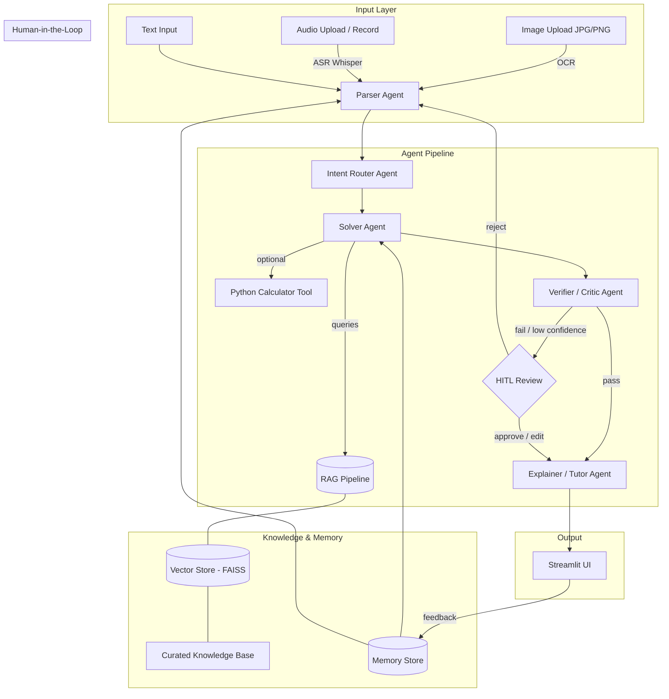

# Math Mentor — Multimodal JEE Math Problem Solver

An AI-powered application that solves JEE-style math problems with step-by-step explanations. Supports image, audio, and text inputs with a RAG pipeline, multi-agent system, human-in-the-loop review, and memory-based self-learning.

## Architecture



## Quick Start

### 1. Clone and install

```bash
git clone <repo-url>
cd assesment_1
pip install -r requirements.txt
```

### 2. Set up environment

```bash
cp .env.example .env
# Edit .env and add your OPENAI_API_KEY
```

### 3. Build the RAG index

```bash
python -m rag.indexer
```

### 4. Run the app

```bash
streamlit run app.py
```

## Features

| Feature | Description |
|---|---|
| **Multimodal Input** | Text, Image (OCR via Tesseract/EasyOCR), Audio (ASR via Whisper) |
| **RAG Pipeline** | 23 curated math docs → FAISS vector search → top-k retrieval |
| **5-Agent System** | Parser → Router → Solver → Verifier → Explainer |
| **HITL Review** | Triggered on low OCR/ASR/verifier confidence or parser ambiguity |
| **Memory & Learning** | SQLite + FAISS memory for similar problem retrieval and correction rules |
| **Calculator Tool** | Sympy-based symbolic math (derivatives, integrals, equations, matrices) |

## Supported Math Topics

- Algebra (identities, equations, inequalities, sequences, logarithms, complex numbers)
- Probability (basics, conditional, distributions, permutations/combinations)
- Calculus (limits, derivatives, applications, integration)
- Linear Algebra (matrices, determinants, vectors, systems of equations)

## Project Structure

```
├── app.py                    # Streamlit UI
├── agents/
│   ├── orchestrator.py       # Pipeline coordinator
│   ├── parser_agent.py       # Input → structured problem
│   ├── router_agent.py       # Intent classification
│   ├── solver_agent.py       # RAG-augmented solver
│   ├── verifier_agent.py     # Solution verification
│   └── explainer_agent.py    # Student-friendly explanation
├── rag/
│   ├── indexer.py            # Chunk, embed, FAISS index
│   ├── retriever.py          # Query FAISS, return top-k
│   └── knowledge_base/       # 23 curated markdown docs
├── input/
│   ├── text_handler.py       # Text input
│   ├── image_handler.py      # OCR pipeline
│   └── audio_handler.py      # ASR pipeline
├── hitl/
│   └── review.py             # HITL trigger logic
├── memory/
│   ├── store.py              # SQLite + FAISS memory
│   └── correction_rules.json # Learned corrections
├── tools/
│   └── calculator.py         # Sympy calculator
└── tests/
```

## Environment Variables

| Variable | Description | Default |
|---|---|---|
| `OPENAI_API_KEY` | OpenAI API key (required) | — |
| `WHISPER_MODEL` | Whisper model size | `base` |
| `OCR_ENGINE` | OCR engine | `tesseract` |
| `FAISS_INDEX_PATH` | Path to FAISS index | `./data/faiss_index` |
| `MEMORY_DB_PATH` | Path to SQLite memory DB | `./data/memory.db` |

## License

MIT
"# AI-planet-Assignment" 
